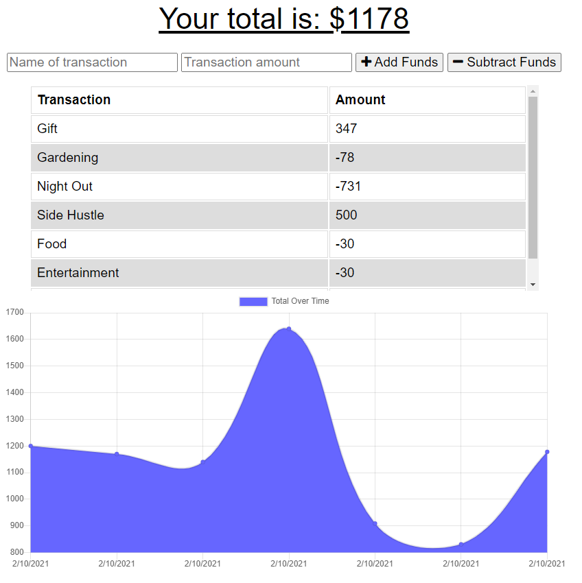

# U18 Budget Tracker
[](https://opensource.org/licenses/MIT)
[]
[]
[]

## Description
A simple PWA budget app that allows the user to enter transactions even offline, saving them in IndexedDB until a connection is restored.

## Deployment
[Live on Heroku](https://powerful-river-91365.herokuapp.com/)

## Table of Contents
* [Installation](#Installation)
* [Usage](#Usage)
* [Contributing](#Contributing)
* [Tests](#Tests)
* [Questions](#Questions)
* [License](#License)

screenshot.png


## Installing
- ```git clone``` to get local copy
- ```npm install``` to install packages
- ```npm start``` or ```nodemon server.js``` to run

## Usage
1. Enter a name for the transaction
2. Enter an amount
3. Click Add Funds for a "deposit" or Subtract Funds for a "withdrawal"

### Contributing
Fork a copy and have fun!

### Tests
none provided

### Questions
- Find me on Github: [skelliebunnie](https://github.com/skelliebunnie)
- Email me at: skelliebunnie@gmail.com

### License
Copyright (C) 2021 Angel

https://opensource.org/licenses/MIT

Permission is hereby granted, free of charge, to any person obtaining a copy of this software and associated documentation files (the "Software"), to deal in the Software without restriction, including without limitation the rights to use, copy, modify, merge, publish, distribute, sublicense, and/or sell copies of the Software, and to permit persons to whom the Software is furnished to do so, subject to the following conditions:

The above copyright notice and this permission notice shall be included in all copies or substantial portions of the Software.

THE SOFTWARE IS PROVIDED "AS IS", WITHOUT WARRANTY OF ANY KIND, EXPRESS OR IMPLIED, INCLUDING BUT NOT LIMITED TO THE WARRANTIES OF MERCHANTABILITY, FITNESS FOR A PARTICULAR PURPOSE AND NONINFRINGEMENT. IN NO EVENT SHALL THE AUTHORS OR COPYRIGHT HOLDERS BE LIABLE FOR ANY CLAIM, DAMAGES OR OTHER LIABILITY, WHETHER IN AN ACTION OF CONTRACT, TORT OR OTHERWISE, ARISING FROM, OUT OF OR IN CONNECTION WITH THE SOFTWARE OR THE USE OR OTHER DEALINGS IN THE SOFTWARE.